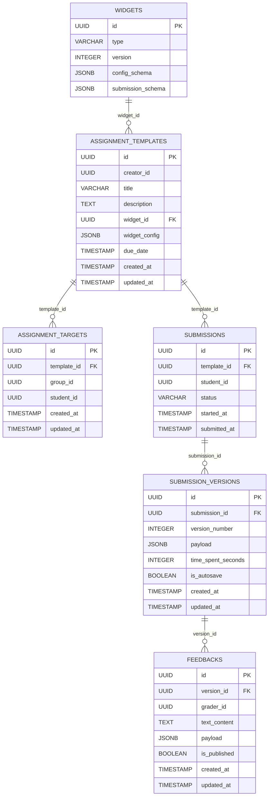

# 📚 Database Schema Documentation

## Overview

This scheme describes a service for managing assignments, their templates, submissions, solution versions, and feedback.

Main entities:

- **Widgets** — types of assignments (e.g., forms, tests, etc.)
- **Assignment Templates** — assignment templates
- **Assignment Targets** — whom the assignment is assigned to
- **Submissions** — attempts to complete the assignment
- **Submission Versions** — versions of solutions (including autosaves)
- **Feedbacks** — feedback from reviewers

---

## 📊 ER Diagram

