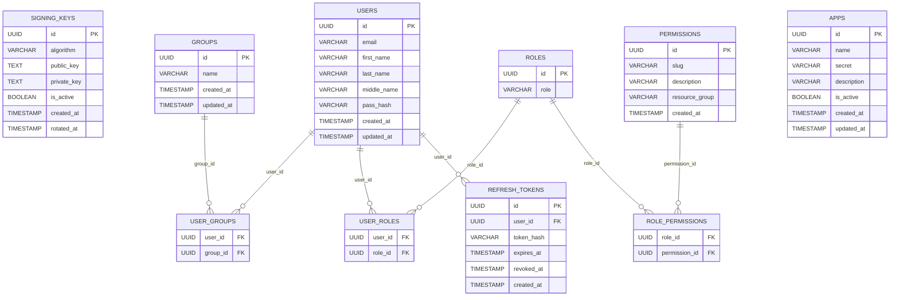

# Database Schema Documentation

## Overview

This schema describes a service for managing users, groups, their relationships, permissions and jwt tokens.

Main entities:

- **Users** — stores user account information
- **Groups** — logical collections of users
- **Roles** — defines roles that can be assigned to users (RBAC)
- **Permissions** — represents fine-grained access rights to system resources
- **Apps** — registered services or client applications within the system
- **Signing keys** — cryptographic keys used for signing and verifying JWTs (with support for key rotation)
- **Refresh tokens** — stores issued refresh tokens used to obtain new access tokens

---

## ER Diagram

